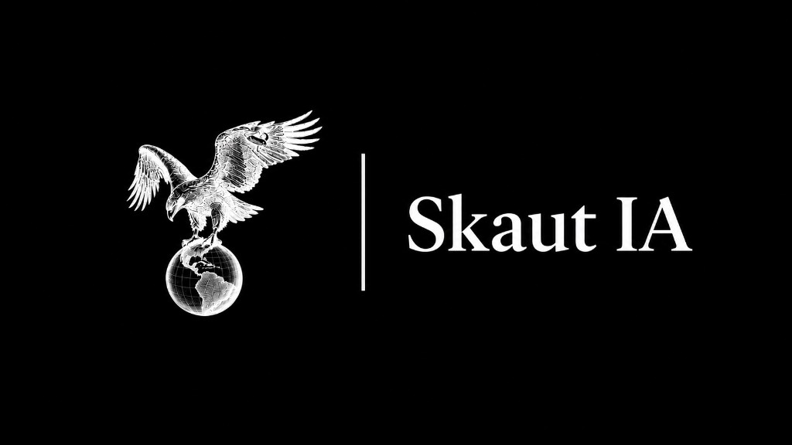

<p align="center">
  
</p>

# Skaut Release

Notas de versión y documentación de los lanzamientos de **Skaut IA**, el agente de inteligencia para análisis de oportunidades de inversión en Colombia.

## Inicio rápido

```bash
npm install
npm run dev
```

Abre [http://localhost:3000](http://localhost:3000)

## Agregar una versión

Crea un archivo Markdown en `content/releases/`:

```markdown
---
version: "skaut-2.0"
title: "Título del release"
date: "2026-07-01"
tag: "Mejoras"
summary: "Resumen corto del release."
---

## Novedades
- ...
```

## Stack

Next.js 15 · React 19 · TypeScript · Tailwind CSS 4

---

**David Solano**
